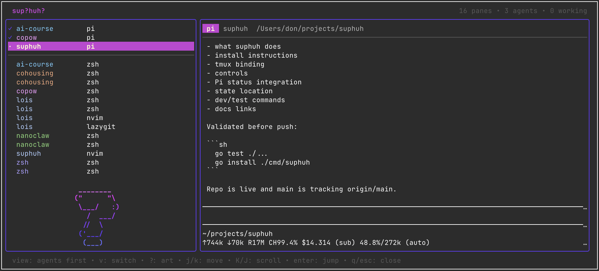

# suphuh

A small tmux popup for answering one question quickly: **sup?huh?**

In practice: press a tmux keybinding, see what your coding agents are doing, preview their panes, and jump to the one that needs attention.



This is a personal workflow tool. It is intentionally tmux-first, keyboard-first, and optimized for checking on multiple coding-agent panes without switching sessions/windows manually.

## Features

- Centered tmux popup UI.
- Live list of tmux panes.
- `all` and `agents first` views.
- Live preview of the selected pane via `tmux capture-pane`.
- Jump to selected pane with `Enter`.
- Vim-style navigation.
- Persistent selected pane, view mode, and ASCII-art choice.
- Pi coding agent status integration:
  - working spinner
  - waiting question-mark indicator
  - idle checkmark
- Process-tree labels so Pi shows as `pi` instead of `node`.
- Tasteful terminal nonsense, including cycleable question-mark ASCII art.

## Install

Requires:

- Go
- tmux

Install from this repo:

```sh
go install ./cmd/suphuh
```

After the repo is available on GitHub, this should also work:

```sh
go install github.com/don-smith/suphuh/cmd/suphuh@latest
```

## Tmux binding

Recommended binding:

```tmux
bind-key K display-popup -E -w 55% -h 65% "$HOME/go/bin/suphuh"
```

Reload tmux config:

```sh
tmux source-file ~/.tmux.conf
```

Then open with:

```text
prefix + K
```

From a shell, you can test the popup with:

```sh
tmux display-popup -E -w 55% -h 65% "$HOME/go/bin/suphuh"
```

## Controls

Inside suphuh:

| Key | Action |
| --- | --- |
| `j` / `k` | Move selection down/up |
| `J` / `K` | Scroll preview down/up one line |
| `v` | Toggle view: `all` / `agents first` |
| `?` | Cycle ASCII art |
| `Enter` | Jump to selected tmux pane |
| `q` / `Esc` | Close popup |

If the preview is at the bottom, it follows live output. If you scroll up, auto-follow pauses until you scroll back to the bottom or select another pane.

## Pi status integration

Install the Pi extension:

```sh
suphuh install-hook pi
```

This writes:

```text
~/.pi/agent/extensions/suphuh-status.ts
```

For existing Pi sessions, run:

```text
/reload
```

or restart Pi. New Pi sessions load it automatically.

The extension writes status files under:

```text
~/.suphuh/status/
```

suphuh reads those files and renders status glyphs in the pane list. New hooks write `working`, `waiting`, and `idle`; old `blocked` reports are accepted as a legacy alias for `waiting`.

## Plain list mode

```sh
suphuh --list
```

## State

suphuh stores lightweight local state in:

```text
~/.suphuh/state.json
```

This currently includes:

- selected pane id
- view mode
- selected ASCII art

## Development

Run tests:

```sh
go test ./...
```

Run the visual-ish TUI snapshot test:

```sh
go test ./internal/tui -run TestViewVisualSnapshot -v
```

Run locally:

```sh
go run ./cmd/suphuh
```

## Docs

- [`docs/product.md`](docs/product.md)
- [`docs/architecture.md`](docs/architecture.md)
- [`docs/testing.md`](docs/testing.md)
- [`docs/adapter-interface.md`](docs/adapter-interface.md)
- [`docs/status.md`](docs/status.md)
- [`docs/backlog.md`](docs/backlog.md)
